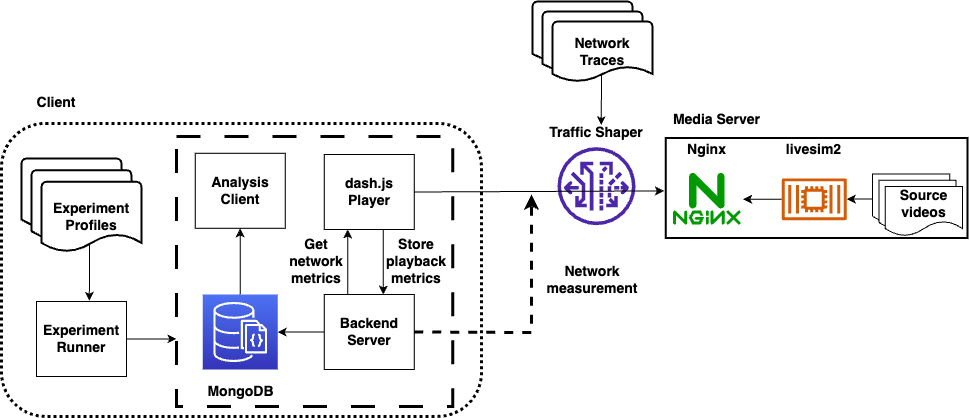

# LEOLiveStreaming

This repository contains the implementation and artifacts of the paper ***Live Video Streaming over Low-Earth-Orbit Satellite Networks: A Multi-Constellation Evaluation*** submitted to *ACM Transactions on Multimedia Computing, Communications, and Applications*.

Table of Contents
=================

  * [Repository structure](#repository-structure)
  * [Prerequisites](#prerequisites)
  * [Paper figures](#paper-figures)
  * [Emulation](#emulation)
  * [Real world experiments](#real-world-experiments)
  * [Extensions](#extensions)
  * [License](#license)

## Repository structure

```
├── assets                           # figures for README.md
├── docker-compose-client.yaml       # docker compose file for the streaming client in real world experiments
├── docker-compose-emulation.yaml    # docker compose file for network emulation evaluation
├── docker-compose-server.yaml       # docker compose file for the media server in real world experiments
├── Dockerfile-dashjs                # Dockerfile to build dash.js
├── Dockerfile-livesim2              # Dockerfile to build livesim2
├── Dockerfile-nginx                 # Dockerfile to build Nginx in real world experiments
├── Dockerfile-nginx-emulation       # Dockerfile to build Nginx in network emulation, along with traffic shaper
├── Dockerfile-runner                # Dockerfile to build experiment scheduler and runner
├── etc                              # Nginx configuration files
├── experiments                      # Experiment profiles
├── LICENSE
├── paper-figures                    # Scripts to recreate figures in the paper
├── plot                             # Scripts to create figures after video streaming evaluation
├── poetry.lock
├── pyproject.toml
├── README.md
├── runner                           # experiment scheduler and runner
├── shaper                           # trace-driven traffic shaper
├── stats-server                     # backend server to store playback metrics and network measurement
└── webassembly                      # Custom Pyodide WebAssembly Python runtime
```

---

## Prerequisites

### Docker

Any system capable of running recent versions of [Docker](https://docs.docker.com/engine/install/) and [Docker Compose](https://docs.docker.com/compose/) should suffice. The live video streaming emulation results of this paper were produced on Debian 12.8 x86-64 with Docker version 27.3.1 and the [Compose plugin](https://docs.docker.com/compose/install/linux/) version 2.29.7. However, the [Compose standalone](https://docs.docker.com/compose/install/standalone/) should also work.

To install Docker and the Docker Compose plugin on a recent Linux distribution, you can use the following automated installation script.

```bash
curl -fsSL https://get.docker.com | sh
```

### Required prerequisites for development

```bash
sudo apt-get update && sudo apt-get install curl git pipx vim zstd -y
pipx install poetry
```

Add `$HOME/.local/bin` to your `$PATH`, and install the required Python packages.

```bash
poetry install
```

Use `poetry shell` to launch a virtual environment with the installed Python packages.

---

This repository contains the following components.

[Paper figures](#paper-figures)

[Emulation](#emulation)

[Real world experiments](#real-world-experiments)

## Paper Figures

You can recreate figures in the paper with corresponding scripts in the [paper-figures](./paper-figures/) directory.

## Emulation

The topology for our network emulator is shown as follows.



To conduct video streaming using our purpose-built network emulator, please follow the following steps.

0. Apply file watch limit adjustment on the Linux machine used to run emulations

```bash
echo fs.inotify.max_user_watches= 131070 | sudo tee -a /etc/sysctl.conf && sudo sysctl -p
```

1. Pull Docker images used in emulation.

```bash
sudo docker compose -f docker-compose-emulation.yaml pull
```

or build from scratch.

```bash
sudo docker compose -f docker-compose-emulation.yaml build
```

2. The `Experiment Profiles` are defined in the [experiments](./experiments/) directory, which are a set of JSON files with the following format:

```json
[
  {
        "EMULATION": true,
        "EMULATION_PROFILE": "bent_pipe_victoria_1",
        "VIDEO_PROFILE": "tos",
        "ROUND_DURATION": 600,
        "CMAB_ALPHA": 1.0,
        "TARGET_LATENCY": 3,
        "CONSTANT_VIDEO_BITRATE": -1,
        "TOTAL_ROUNDS": 2,
        "MPD_URL": "http://dashjs-nginx/livesim2/tos/WAVE/vectors/switching_sets/15_30_60/ss1/2023-10-05/stream.mpd",
        "ABR_ALGORITHM": "abrCMAB",
        "CATCH_UP": "liveCatchupModeCMAB"
    },
    ...
]
```

**`EMULATION_PROFILE`**

By default, there are six different `EMULATION_PROFILE`s, as shown in [Figure 7](./paper-figures/figure7/), with the following keys can be selected for `EMULATION_PROFILE`:

```bash
bent_pipe_victoria_1
bent_pipe_victoria_2
bent_pipe_victoria_3
bent_pipe_victoria_4
bent_pipe_victoria_5
oneweb_iowa
```

**`ROUND_DURATION`**

If you are using the default latency traces as shwon above, the maximal `ROUND_DURATION` can be set is `600` as each latency profile lasts around 10 minutes.

**`VIDEO_PROFILE`**

There are two test videos available as built by [Dockerfile-livesim2](./Dockerfile-livesim2), `tos` and `croatia`, each has a corresponding `MPD_URL` as follows:

```
http://dashjs-nginx/livesim2/tos/WAVE/vectors/switching_sets/15_30_60/ss1/2023-10-05/stream.mpd
http://dashjs-nginx/livesim2/croatia/WAVE/vectors/switching_sets/12.5_25_50/ss1/2023-10-05/stream.mpd
```

**`ABR_ALGORITHM`**

The following ABR algorithms are supported by default:

```
abrDynamic
abrL2A
abrLoLP
abrCMAB
```

3. Start video streaming emulation with Docker Compose.

```bash
sudo docker compose -f docker-compose-emulation.yaml up -d
```

4. A convenience container is available to display the video streaming browser output using noVNC. This can be accessed by navigating to `http://<host-ip>:7900/?autoconnect=1&resize=scale&password=secret` in a web browser, where `<host-ip>` represents the IP address of the Linux machine on which the emulation takes place. The video streaming browser output is recorded for visual inspection.

You can disable the video recording by setting the `VIDEO` environment variable to `0` in [`docker-compose-emulation.yaml`](./docker-compose-emulation.yaml).

5. You can check the experiment running process and logs by

```bash
sudo docker logs -f dashjs-runner
```

where the expected execuation time for the entire experiment set will be printed.

```bash
[...]
2024-12-24 04:49:57.354 INFO batch_runner - <module>: Total experiment count: 80, duration: 48000 seconds (13.333333333333334 hours)
2024-12-24 04:49:57.354 INFO batch_runner - <module>: running tos-bent_pipe_victoria_1-abrCMAB-1223-2049-target-latency-3s-duration-600-bitrate-variable-0, (1/80)
2024-12-24 04:49:57.354 INFO video - create_nginx_with_trace: creating nginx with trace profile bent_pipe_victoria_1
2024-12-24 04:49:57.785 INFO single_runner - run_once: running tos-bent_pipe_victoria_1-abrCMAB-1223-2049-target-latency-3s-duration-600-bitrate-variable-0
2024-12-24 04:49:57.785 INFO single_runner - run_once: wait 10 seconds before connecting to remote chrome
[...]
```

6. When video streaming emulation finishes, `dashjs-runner` container will output the following log and exit.

```bash
[...]
2024-12-24 08:54:46.489 INFO batch_runner - <module>: Video Streaming completed.
```

The raw data will be available in the `figures` folder.

7. Plot all the figures similar to Figure 8 to Figure 10 by

```bash
cd plot
make
```

8. After finishing the emulation, you can cleanup the resources by

```bash
sudo docker compose -f docker-compose-emulation.yaml down
```

## Real world experiments

To reuse our code for conducting video streaming over real networks, please follow the following steps.

### Media Server

If you are evaluating live video streaming over Starlink, it is recommended to set up the media server at the cloud server provider that is closest to your Starlink Point-of-Presence (PoP). Typically, either Akamai Linode or Google Cloud Platform would be a good choice.

You can verify the latency and network path from your Starlink installation to the media server by using `traceroute` or `mtr`, e.g.,

```
HOST:                                                                                                              Loss%   Snt   Last   Avg  Best  Wrst StDev
  1.|-- customer.sttlwax1.pop.starlinkisp.net (2605:59c8:xxxx)                                                      0.0%    10    0.3   0.4   0.2   0.8   0.2
  2.|-- customer.sttlwax1.pop.starlinkisp.net (2605:59c8:xxxx)                                                      0.0%    10   29.6  32.0  21.6  60.6  14.1
  3.|-- host.starlinkisp.net (2620:134:b0fe:252::40)                                                                0.0%    10   22.2  32.7  21.7  56.4  10.5
  4.|-- host.starlinkisp.net (2620:134:b0ff::30a)                                                                   0.0%    10   22.8  27.6  20.1  38.5   7.2
  5.|-- host.starlinkisp.net (2620:134:b0ff::3e5)                                                                   0.0%    10   27.7  29.1  18.5  46.7   8.6
  6.|-- undefined.hostname.localhost (2605:59c7:9001::13)                                                           0.0%    10   28.3  35.9  18.1  59.6  11.3
  7.|-- g2600-1488-a000-0220-0000-0000-0000-000b.deploy.static.akamaitechnologies.com (2600:1488:a000:220::b)       0.0%    10   29.2  36.3  19.7  63.1  14.3
  8.|-- g2600-1409-a800-0300-fffe-0000-0000-0001.deploy.static.akamaitechnologies.com (2600:1409:a800:300:fffe::1)  0.0%    10   21.6  31.5  21.6  39.5   6.8
  9.|-- lo1.r01b.tor107.sea01.fab.netarch.akamai.com (2600:1409:a800:8600:ffff::)                                   0.0%    10   22.2  33.8  22.2  43.9   6.9
 10.|-- vlan202.r04.leaf107.sea01.fab.netarch.akamai.com (2600:1409:a800:7c02::)                                    0.0%    10   22.9  32.5  21.1  62.9  12.0
 11.|-- vlan228.r18.spine101.sea01.fab.netarch.akamai.com (2600:1409:a800:171c::)                                   0.0%    10   19.6  30.1  19.6  41.9   7.4
 12.|-- vlan118.r04.leaf106.sea01.fab.netarch.akamai.com (2600:1409:a800:1718::1)                                   0.0%    10   28.1  36.0  20.4  60.3  12.9
 13.|-- vlan104.r16b.tor106.sea01.fab.netarch.akamai.com (2600:1409:a800:7820::1)                                   0.0%    10   24.7  28.3  21.5  45.0   7.1
 14.|-- 2600:3c0f:20:6:27::496                                                                                      0.0%    10   21.5  28.2  19.9  42.5   6.8
 15.|-- 2600:3c0f:20:8::92                                                                                          0.0%    10   18.2  33.5  18.2  43.6   7.2
 16.|-- REDACTED                                                                                                    0.0%    10   23.0  31.4  21.3  50.3   9.2
```

In this example, the media server is created in Akamai Linode's `us-sea` availability zone in Seattle, and the client is connected to a Starlink dish associated with the Starlink Seattle PoP (`sttlwax1`).

Hop 2 is where the network packets reached the landing ground station gateway across the satellite link, and after Hop 6, the traffic exits Starlink backbone network and entered Akamai.

### Media VM Setup

1. Apply File Watch Limit adjustment

```bash
echo fs.inotify.max_user_watches= 131070 | sudo tee -a /etc/sysctl.conf && sudo sysctl -p
```

2. For real world experiments, deploy live video streaming media server on the VM by

```bash
sudo docker compose -f docker-compose-server.yaml pull
sudo docker compose -f docker-compose-server.yaml up -d
```

3. The MPD file will be available at

```
http://<ip-or-domain-of-the-media-server>/livesim2/tos/WAVE/vectors/switching_sets/15_30_60/ss1/2023-10-05/stream.mpd
http://<ip-or-domain-of-the-media-server>/livesim2/croatia/WAVE/vectors/switching_sets/12.5_25_50/ss1/2023-10-05/stream.mpd
```

By default, host port 80 on the media VM will be used for the Nginx container to serve MPD files.

4. Update experiment profiles in [experiments/starlink](./experiments/starlink/) with the new MPD_URL by replacing <ip-or-domain-of-the-media-server>, and specify the experiment profile to be used in `docker-compose-client.yaml` under the `runner` service.

5. The subsequent steps are similar to network emulation, but you need to replace `docker-compose-emulation.yaml` with `docker-compose-client.yaml` in the command.

## Extensions

### Custom video dataset

To replace the default bitrate ladder and use custom video datasets, replace and update the following lines in [Dockerfile-livesim2](./Dockerfile-livesim2) accordingly,

```Dockerfile
# RUN ./dashfetcher -a
        # test content from https://cta-wave.github.io/Test-Content/
        #    croatia
        #    https://dash.akamaized.net/WAVE/vectors/switching_sets/12.5_25_50/ss1/2023-10-05/stream.mpd

        #    tos
        #    https://dash.akamaized.net/WAVE/vectors/switching_sets/15_30_60/ss1/2023-10-05/stream.mpd

RUN wget https://starlink-dash-live.jinwei.me/tos.zip && unzip tos.zip && rm tos.zip
RUN wget https://starlink-dash-live.jinwei.me/croatia.zip && unzip croatia.zip && rm croatia.zip

RUN cd /livesim2/tos/WAVE/vectors && \
    mv cfhd_sets chdf_sets switching_sets/15_30_60/ss1/2023-10-05 && \
    cd switching_sets/15_30_60/ss1/2023-10-05 && \
    sed -i -e 's/..\/..\/..\/..\///g' stream.mpd && \
    cd /livesim2/croatia/WAVE/vectors && \
    mv cfhd_sets chdf_sets switching_sets/12.5_25_50/ss1/2023-10-05/ && \
    cd switching_sets/12.5_25_50/ss1/2023-10-05/ && \
    sed -i -e 's/..\/..\/..\/..\///g' stream.mpd
```

and rebuild the `livesim2` Docker image and replace the image used by the `livesim2` service in the corresponding `docker-compose.yaml` file.

## License

The code in this repository is licensed under [GPL-3.0](./LICENSE).
