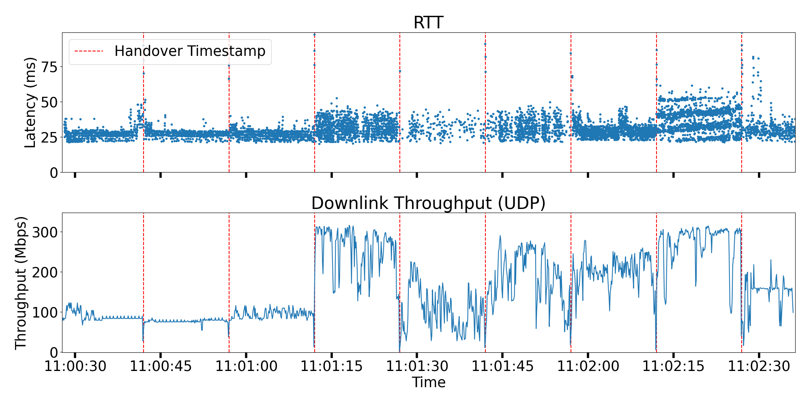

## Figure 3



To recreate Figure 3, first decompress the latency traces inside [data](./data/) subfolder with the following command.

```bash
tar -xf data/figure3.tar.zst --directory=data
```

Then, run `python3 figure3.py`.

You can also use `iperf3-udp-irtt.py` to collect new time-synchronized traces for IRTT and iPerf3 with the adjustable parameters as defined.
