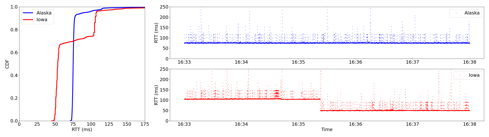

## Figure 4



To recreate Figure 4, first decompress the latency traces inside [Alaska](./Alaska/) and [Iowa](./Iowa/) subfolders with the following command.

```bash
tar -xf Alaska/ping-oneweb-alaska.txt.tar.zst --directory=Alaska
tar -xf Iowa/ping-oneweb-arawireless.txt.tar.zst --directory=Iowa
```

Then, run `python3 figure4.py`.
