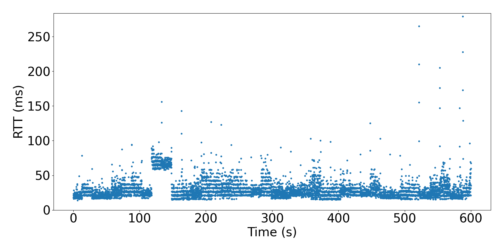
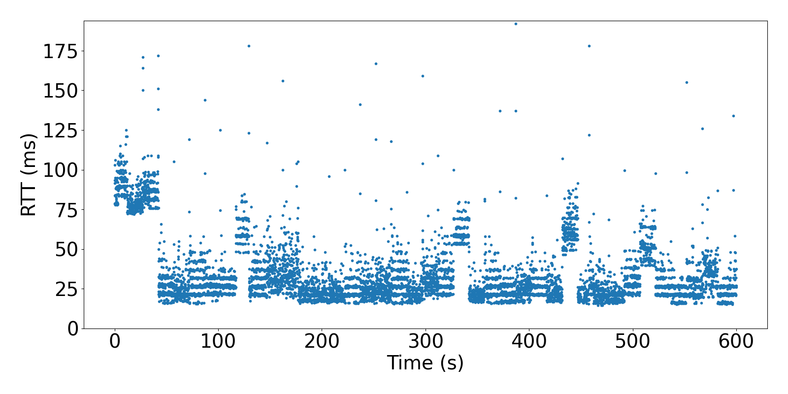
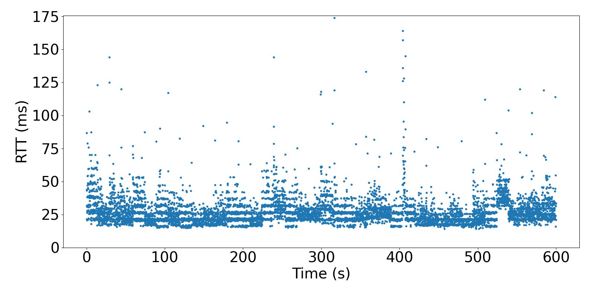
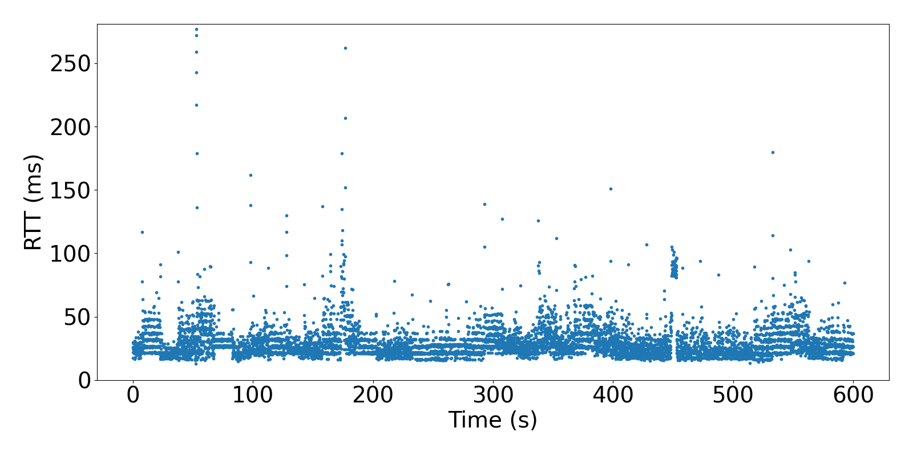
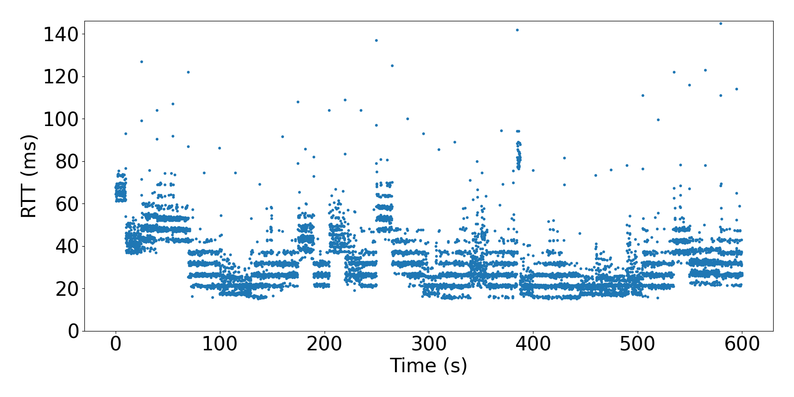
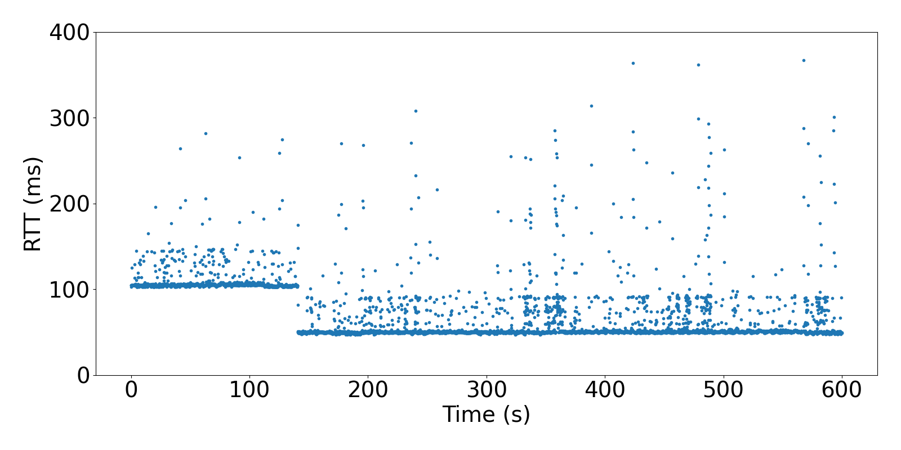

## Figure 7








To recreate Figure 7, first decompress the latency traces inside the [data](./data) subfolders with the following command.

```bash
tar -xf data/figure7.tar.zst --directory=data
```

Then, run `python3 figure7.py`.
